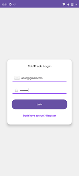
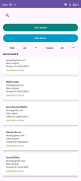

# EduTrack 📚

Role-based Android app for managing students, teachers, departments, semesters, attendance, and marks — built with Firebase.

<p align="center">
  <a href="https://github.com/ok-Arun/ERP_AndroidStudio_project/releases">
    <b>⬇️ Download the latest APK (Releases)</b>
  </a>
  <br/>
  or direct file:
  <a href="https://raw.githubusercontent.com/ok-Arun/ERP_AndroidStudio_project/master/build/EduTrack-%20ERP.apk">EduTrack – ERP.apk</a>
</p>

---

## Table of Contents
- [Features](#-features)
- [Tech Stack](#-tech-stack)
- [Download](#-download)
- [Build & Run (Developers)](#-build--run-developers)
- [Firebase Setup](#-firebase-setup)
- [Project Structure](#-project-structure)


---

## ✨ Features
- **Authentication & Roles** — Firebase Auth with **Student / Teacher / Admin** flows
- **Admin**
  - Manage users (approve, promote/demote, remove)
  - Create departments, add semesters, add papers and courses
  - Assign teachers to courses and papers
  - Transfer students across semesters in bulk
- **Teacher**
  - View assigned courses
  - Record and review attendance
  - Manage marks and evaluations
- **Student**
  - Complete profile setup & dashboard
  - View attendance and marks
- **Custom IDs**
  - Students: `bcaYY-XXX` (e.g., `bca24-001`)
  - Teachers: `tYYXXX` (e.g., `t25001`)

---

## 🛠️ Tech Stack
- **Language**: Java  
- **IDE**: Android Studio  
- **Database**: Firebase Realtime Database  
- **Authentication**: Firebase Auth  
- **UI**: XML layouts, Material Components  

---

## 📥 Download
- [Releases Page](https://github.com/ok-Arun/ERP_AndroidStudio_project/releases)  
- Or direct APK: [EduTrack – ERP.apk](https://raw.githubusercontent.com/ok-Arun/ERP_AndroidStudio_project/master/releases/EduTrack-%20ERP.apk)  

---

## 🚀 Build & Run (Developers)
1. Clone this repo:  
   ```bash
   git clone https://github.com/ok-Arun/ERP_AndroidStudio_project.git

## 🔥 Firebase Setup
### 1) Create a Firebase Project
1. Go to [Firebase Console](https://console.firebase.google.com/).  
2. Click **Add project** → give it a name (e.g., `EduTrack-ERP`).  
3. Disable Google Analytics (optional) → finish.

### 2) Register Android App
1. In the Firebase project, click **Add app → Android**.  
2. Enter your app package name (example in this repo):
(Use your real package name if different.)
3. Register the app.

### 3) Download & Add `google-services.json`
1. Download the `google-services.json` from Firebase after registering the app.  
2. Place it at: app/google-services.json

## 📂 Project Structure
EduTrack/
├── app/
│   ├── src/
│   │   ├── main/
│   │   │   ├── java/com/example/finalproject/   # Java source code
│   │   │   └── res/                            # XML layouts, drawables
│   ├── build.gradle
│   └── google-services.json (ignored)
├── build/                                      # APK output
├── screenshots/                                # App screenshots
│   ├── login.png
│   ├── dashboard.png
│   └── admin_panel.png
├── README.md
└── .gitignore


 ## 📸 Screenshots  






